<div align="center">

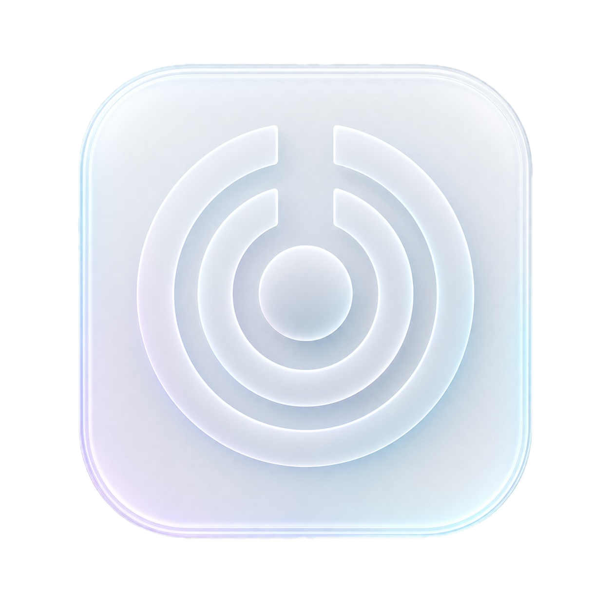

# Roomcut

**Cut the room. Keep the sound.**

**English** · [한국어](docs/README.ko.md) · [日本語](docs/README.ja.md) · [Français](docs/README.fr.md) · [Deutsch](docs/README.de.md)

[](https://github.com/habinsong/roomcut/releases/latest) [](LICENSE)    

     

  

Roomcut 1.0 currently ships: system-wide routing, EQ, limiter, spatial controls, analyzer, presets, Now Playing, and Room Tune.<br>Tested on Apple Silicon Macs running macOS 26+.

</div>

> **Official repository notice**
>
> This is the official repository for **Roomcut**, created and maintained by [habinsong](https://github.com/habinsong).
>
> Repositories, packages, marketplace listings, websites, services, or other projects that copy, mirror, rebrand, or closely imitate this repository's original documentation, README text, architecture descriptions, feature descriptions, screenshots, UI concepts, project metadata, or other original materials are not affiliated with this project unless explicitly stated in this repository.
>
> The source code is licensed under the Apache License 2.0 (see [LICENSE](LICENSE)). The Roomcut name, branding, screenshots, and documentation are © 2026 송하빈 and are not covered by that license.

Roomcut is a system-wide audio processor for macOS. It adds a virtual output
device, runs everything your Mac plays through a real-time DSP chain, and sends
the result to whatever speakers, headphones, or DAC you actually use. It runs on
a native CoreAudio Audio Server Plug-in, so there's no BlackHole, Soundflower, or
other loopback driver to install alongside it.

Most "audio enhancers" only push the sound outward. Roomcut moves it both ways,
and lets you decide how far. Focus pulls back excessive room ambience and stereo
spread to bring vocals and dialogue closer to the recording; Widen opens the
stage up when you want more space. Reduce it, widen it, or sit anywhere in
between.

<!-- Add a hero screenshot or short GIF here once the UI settles, e.g. docs/assets/roomcut.png -->

---
#### Put simply, Roomcut gives your ears music that's fun to listen to, <br> while its Apple Liquid Glass UI/UX makes it lovely just to look at.
---

<div align="center">
<table>
<tr>
<td align="center" valign="middle">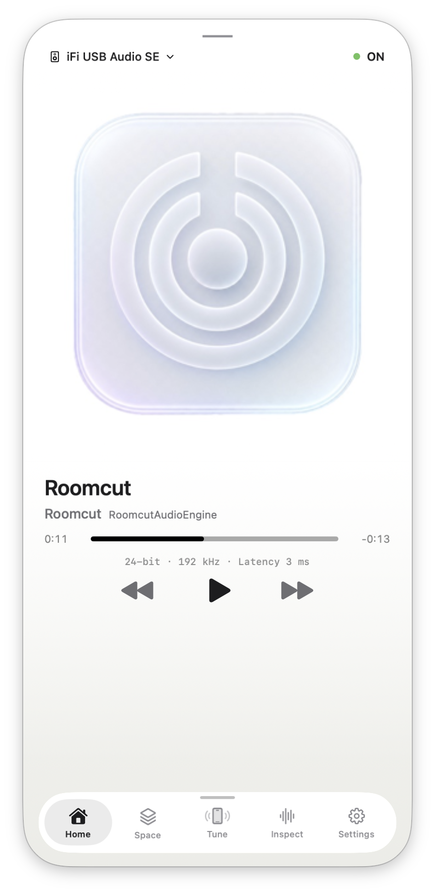<br><sub>Main window</sub></td>
<td align="center" valign="middle">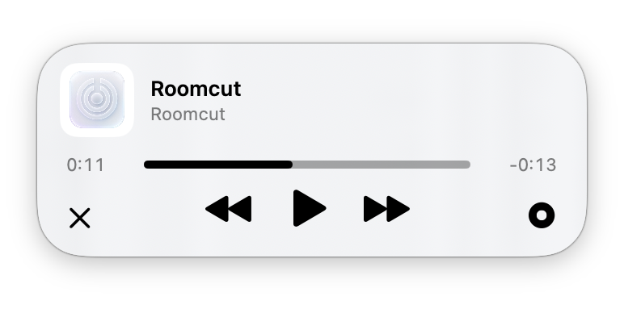<br><sub>Menu bar</sub></td>
<td align="center" valign="middle">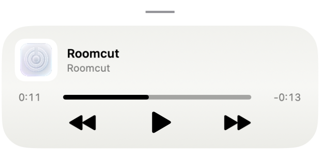<br><sub>Compact mode</sub></td>
</tr>
</table>
</div>

## Features

- **Global EQ.** A 10-band graphic EQ and a 6-band parametric EQ (bell, shelf,
  high/low pass, notch) stacked together, with a live response curve.
- **Macros.** Bass, Warmth, Vocal, Clarity, and Air knobs that move the right
  bands for you, so you don't have to think in frequencies.
- **Spatial, both directions.** Narrow or widen the image, freely: Space (width),
  Center (phantom-center focus), Damping (room reduction), and crossfeed /
  crosstalk. Pick speaker or headphone mode, toggle surround, and a live
  stereo-field view reacts as you adjust; Focus and Widen are one-tap presets.
- **Limiter and gain.** Pre-amp and output trim plus a peak limiter, so a heavy
  EQ curve doesn't clip the output. An optional Volume Leveling knob evens out
  loud and quiet passages for night listening.
- **High-res aware.** Processes in 32-bit float and lets you pick the output
  device's sample rate and bit depth; the Now Playing card shows the live format
  and latency.
- **Analyzer.** Live peak, RMS, stereo width, spectral centroid, a spectrum
  view, and a plain-language label for what's currently playing.
- **Presets.** A built-in library grouped by Signature, Apple gear, Speakers,
  and Headphones, plus your own saved presets. Export and import them as JSON
  files, and let Roomcut remember a preset per output device and switch
  automatically.
- **Room Tune.** Measure your room with an iPhone over the Continuity mic and get
  conservative EQ corrections for its worst resonances. It only cuts, never
  boosts, and saves the result as a preset.
- **Now Playing.** Artwork-driven themes, synced lyrics via
  [LRCLIB](https://lrclib.net), and transport controls in the menu-bar window.
- **Localized UI.** English, Korean, Japanese, French, and German, following the
  system language or a manual override.
- **Fails safe.** If the engine crashes, your output falls back to a real device,
  and raw audio never leaves your Mac.

## How it works

macOS sends audio to "Roomcut Output", a virtual device. The driver is the thin
part: it lives inside `coreaudiod`, does no DSP, and just hands incoming frames
to a helper process over a shared ring buffer. The helper, `RoomcutAudioEngine`,
runs the DSP chain and renders to your real output device.

```
System audio
  → Roomcut Output            virtual device
  → Roomcut.driver            Audio Server Plug-in, sandboxed in coreaudiod
  → shared-memory ring buffer handed over via a Mach service
  → RoomcutAudioEngine        DSP + render
  → speakers / AirPods / DAC / HDMI
```

An Audio Server Plug-in is sandboxed inside `coreaudiod` and can't open arbitrary
sockets or shared memory. Roomcut bootstraps the ring buffer through an
`AudioServerPlugIn_MachServices` connection, the same approach Background Music
uses.

| Component | Role | Language |
|---|---|---|
| `Roomcut.app` | Menu-bar app and Now Playing UI | Swift (SwiftUI + AppKit) |
| `Roomcut.driver` | Virtual output device (Audio Server Plug-in) | C |
| `RoomcutAudioEngine` | Background helper: DSP and rendering | C++ |
| `RoomcutCore` | Shared DSP, presets, and analysis | C++ |
| `RoomcutNowPlaying.dylib` | MediaRemote bridge for Now Playing | Objective-C |

## Requirements

- macOS 26 (Tahoe) or newer. The interface uses the system Liquid Glass APIs.
- Apple Silicon.
- For building: Xcode 26 (it ships the macOS 26 SDK) and CMake.

## Install

There are two ways in. Building from source is the path I'd recommend right now,
since it avoids the Gatekeeper prompts that come with downloaded, un-notarized
binaries.

### Build from source

```sh
git clone https://github.com/habinsong/roomcut.git
cd roomcut

# native driver + engine
cmake -S . -B build
cmake --build build

# the menu-bar app
bash scripts/build-app.sh

# install the driver + engine (prompts for your password, restarts coreaudiod)
sudo bash scripts/install-driver.sh
```

Open `build/Roomcut.app` (it lives in the menu bar, no Dock icon), then choose
"Roomcut Output" in System Settings ▸ Sound, or let the app set it for you.
Installing restarts `coreaudiod`, so system audio glitches for about a second.

### Prebuilt release

Download the latest `.pkg` (double-click) or `.zip` (terminal) from
[Releases](https://github.com/habinsong/roomcut/releases). Prebuilt builds are
currently ad-hoc signed and not notarized, so macOS may ask you to approve them
on first launch: right-click the `.pkg`, choose Open, or run
`sudo installer -pkg Roomcut-*.pkg -target /`. The `.zip` ships an `install.sh`
that handles the rest. Building from source avoids the approval step.

## Usage

With the driver installed and the app open:

1. Pick **Roomcut Output** in System Settings ▸ Sound (or let the app set it).
   Everything your Mac plays now runs through Roomcut.
2. Set the real device Roomcut renders to (your speakers, headphones, or DAC),
   and toggle Roomcut on. Off is a clean bypass.
3. Start from a preset that matches your gear, then fine-tune.

The window has five tabs:

- **Home.** Now Playing, the on/off toggle, and a sound-controls sheet you drag
  up: Bass / Warmth / Vocal / Clarity / Air macros, volume, and the preset
  picker. Drag further for the full 10-band and parametric EQ.
- **Space.** narrow or widen the stereo image, set center focus, room damping,
  and crossfeed, with Focus / Widen presets for speakers or headphones.
- **Tune.** measure your room with an iPhone (Continuity mic) and apply
  conservative EQ corrections.
- **Inspect.** read-only meters: peak, limiter, dropouts, correlation, width,
  sample rate, latency, and engine state.
- **Settings.** output device and format, volume, per-device presets, launch at
  login, appearance (theme, layout, language), preset export / import, and the
  lyrics cache.

<div align="center">
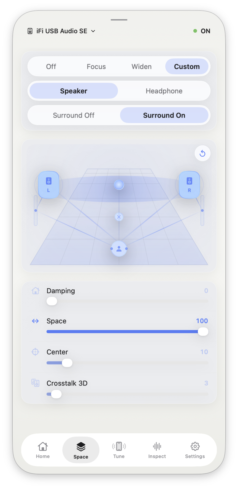 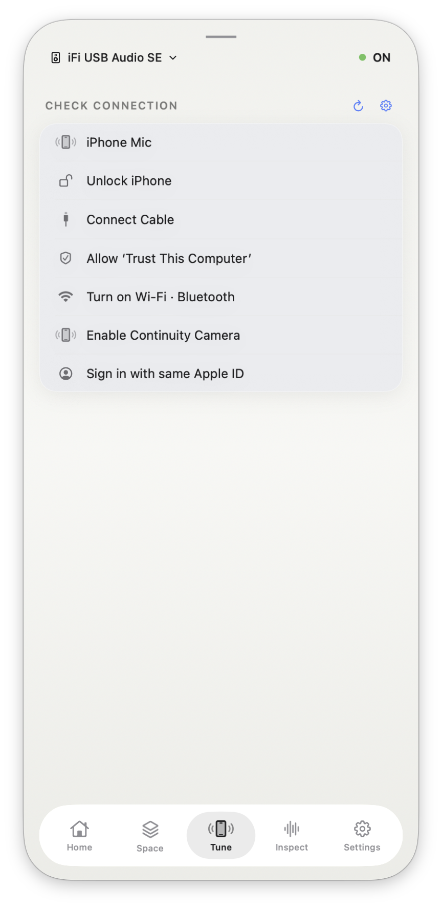 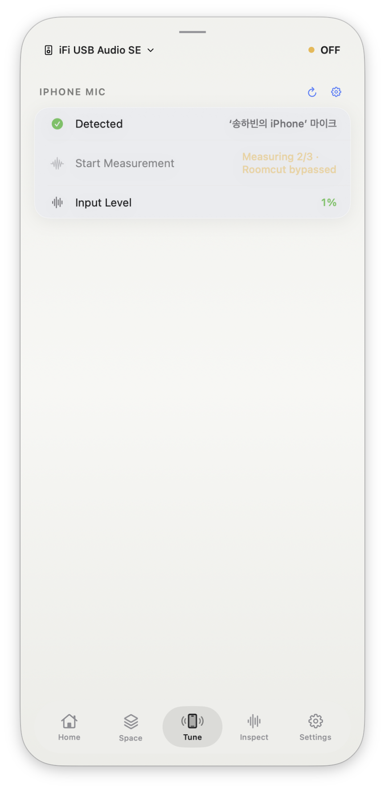 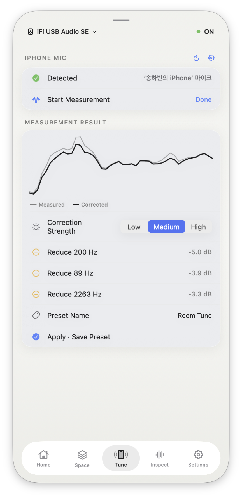 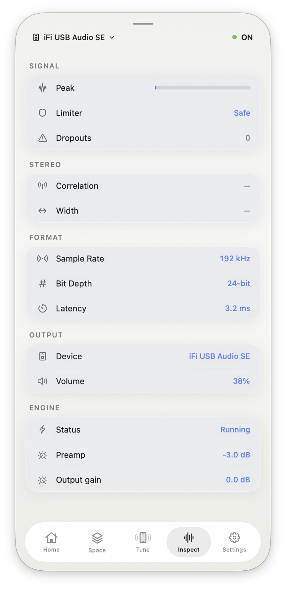
</div>

The window resizes from any edge or corner, and the ↑ / ↓ keys open and close the
sound-controls sheet on Home.

The thin handle bar at the top moves the window. Click it once to collapse the
full window into the compact Now Playing card; in compact mode, click the handle
again to tuck the window away (Roomcut keeps running in the menu bar, it does not
quit), and tap the card to bring it back. The toggle on that bar pins the window
above every other app so it never gets hidden. Roomcut also lives in the menu bar
as a small Now Playing popover with transport controls.

### Basic and Advanced

The sound-controls sheet on **Home** has two modes:

- **Basic** keeps it light: the five macro knobs (Bass, Warmth, Vocal, Clarity,
  Air), a volume slider that can push past 100% up to 200%, an EQ summary curve,
  and the preset picker.
- **Advanced** opens the full set across five sub-tabs:
  - **graph.** The combined EQ response as one read-only curve.
  - **10-Band.** The classic graphic EQ; drag each band by hand.
  - **Parametric.** Six biquad bands (bell, shelf, high/low pass, notch) with
    frequency, gain, and Q.
  - **Limiter.** The peak limiter, pre-amp and output gain, and Volume Leveling
    for night listening.
  - **Analyzer.** Live spectrum with peak, RMS, stereo width, and spectral
    centroid.

<div align="center">
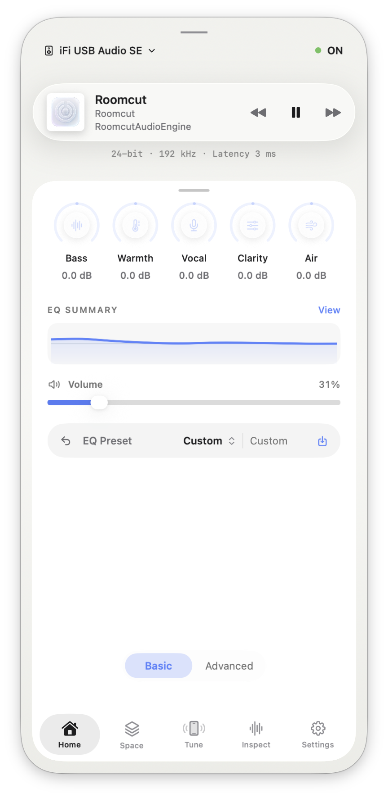 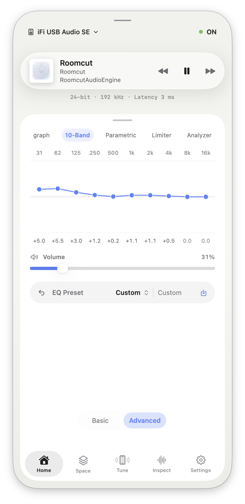
</div>

### Appearance

Settings ▸ Appearance has three quick switches:

- **Auto / Light / Dark.** Follow the system, or force a light or dark app theme.
- **Halo / Cover / Mesh Gradient.** The Now Playing background: a calm glow ring
  around the card (Halo), the album art filling the whole window (Cover), or an
  animated mesh gradient drawn from the artwork colors (Mesh Gradient).
- **Card / Poster.** The Now Playing layout: a single centered card (Card), or a
  full-width cover (Poster).

<div align="center">
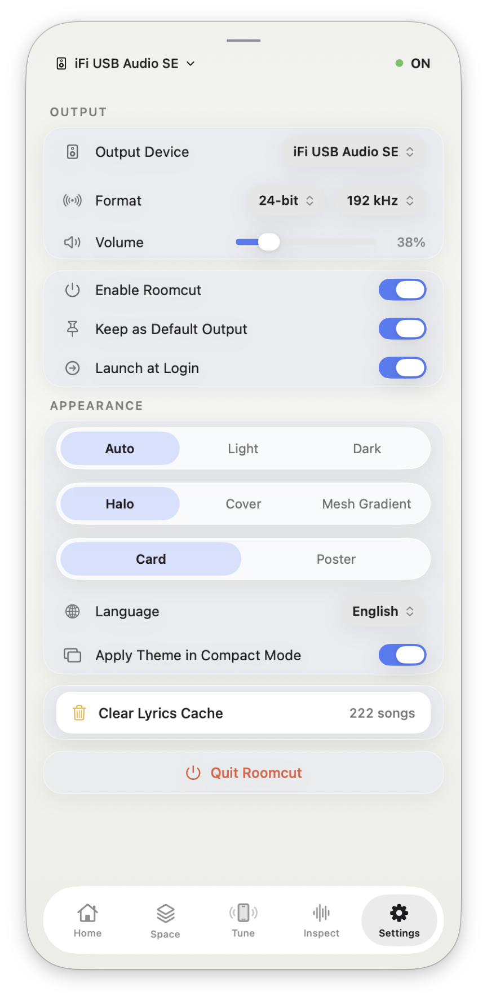
</div>

## Uninstall

```sh
sudo bash scripts/uninstall-driver.sh
```

This removes the driver and engine, restores your previous output device, and
restarts `coreaudiod`. If sound stays quiet afterward, pick a device by hand in
System Settings ▸ Sound.

## Troubleshooting

**"Roomcut Output" doesn't show up in Sound settings.** The driver loads when
`coreaudiod` restarts. Re-run `sudo bash scripts/install-driver.sh` (it restarts
it for you), or reboot. A downloaded driver also must not be quarantined; the
`.pkg` and `install.sh` clear that for you.

**No sound after installing.** Check that Roomcut's own output device is set and
that Roomcut is toggled on. If it's still silent, run
`sudo bash scripts/reset-audio-output.sh`, or pick a device by hand in
System Settings ▸ Sound.

**The app won't open ("unidentified developer").** Prebuilt builds aren't
notarized yet. Right-click the app ▸ Open, or allow it under System Settings ▸
Privacy & Security. Building from source avoids this.

**Lyrics don't show for a song.** Lyrics come from LRCLIB, matched by title,
artist, and duration. macOS doesn't expose a streaming app's own lyrics, so a
track can have lyrics in Apple Music but not here if LRCLIB doesn't have it.

**Spatial controls are greyed out.** They need an engine build that supports
them. Reinstall the latest engine from source.

## Privacy

Roomcut processes everything you hear, so the boundaries matter: raw audio never
leaves your machine, DSP and analysis run locally, and logs keep counters and
device names rather than samples. Room Tune uses the iPhone mic only while a
measurement is running.

## Building and testing

```sh
swift test                          # app / Swift unit tests
ctest --test-dir build --output-on-failure   # native (DSP / engine) tests
```

Both suites run in CI on every push and pull request, on a macOS 26 runner:

[](https://github.com/habinsong/roomcut/actions/workflows/ci.yml)

## Contributing

Issues and pull requests are welcome. The steps above give you a working tree; if
you're picking something up, opening an issue first usually saves everyone time.

## Lyrics and credits

Track info (title, artist, artwork) comes from the system's Now Playing
metadata. Synced lyrics are matched from [LRCLIB](https://lrclib.net) by title,
artist, and duration, fetched on demand and cached locally; Roomcut identifies
itself with a `User-Agent` and never bundles or redistributes lyrics in this
repository. Lyrics belong to their respective owners.

macOS doesn't hand a streaming app's in-app lyrics to other apps, so Roomcut
brings its own from LRCLIB. A song can show lyrics in Apple Music but not here if
LRCLIB doesn't have that track yet.

LRCLIB's own server and client are MIT-licensed, and Roomcut talks to it only
through its public HTTP API, so none of that code ships here.

## License

Roomcut is licensed under the Apache License 2.0. See [LICENSE](LICENSE) for the
full text. The license covers the source code; the Roomcut name and branding
aren't part of the grant, since Apache 2.0 doesn't assign trademark rights.
