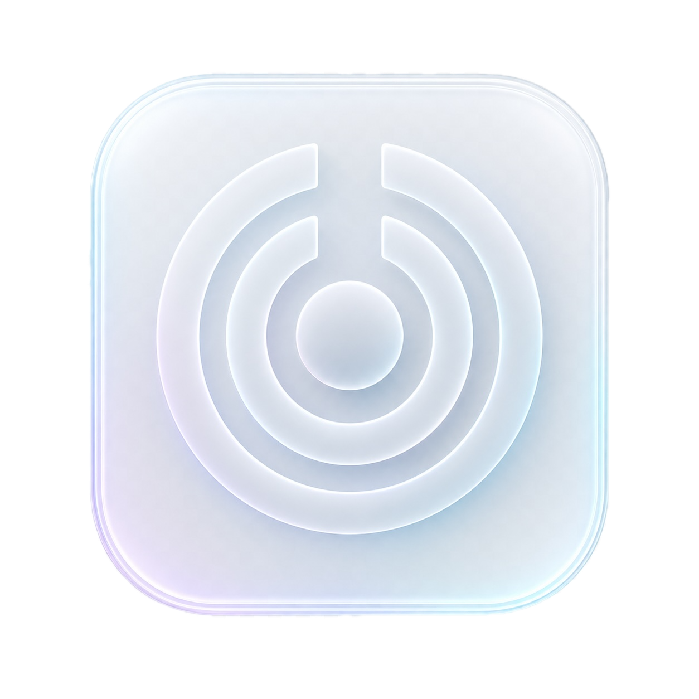
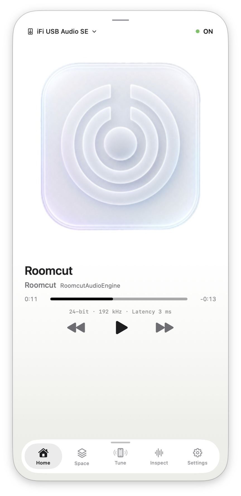
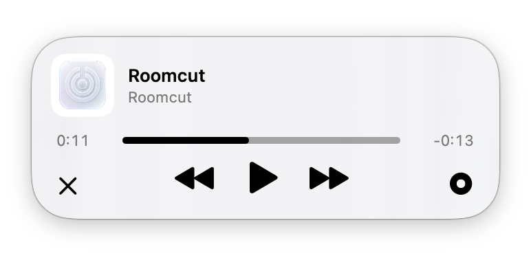
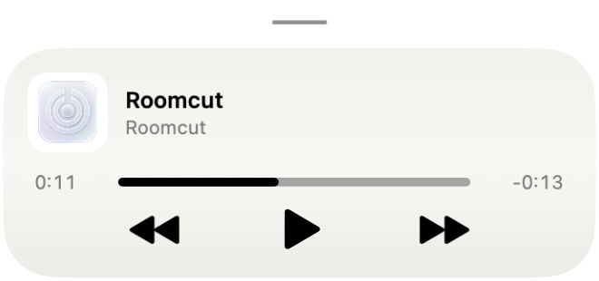

<div align="center">



# Roomcut

[English](../README.md) · [한국어](README.ko.md) · [日本語](README.ja.md) · [Français](README.fr.md) · **Deutsch**

[](https://github.com/habinsong/roomcut/releases/latest) [](../LICENSE)   

</div>

> **Offizielles Repository**
>
> Roomcut wird von [habinsong](https://github.com/habinsong) entwickelt und gepflegt. Kopien, Spiegel, Umbenennungen oder ähnliche Projekte sind nicht mit Roomcut verbunden, sofern dieses Repository es nicht ausdrücklich sagt. Der Quellcode steht unter der Apache License 2.0. Name, Gestaltung, Screenshots und Dokumentation von Roomcut sind © 2026 송하빈 und nicht Teil dieser Lizenz.

macOS hat keinen systemweiten EQ. Wenn deine Lautsprecher bei 120 Hz 6 dB zu laut sind,
korrigierst du das in der einen App, die zufällig einen Equalizer mitbringt — sonst nirgends.

Roomcut legt ein Ausgabegerät namens **Roomcut Output** an. Schick macOS dorthin, und alles
läuft auf dem Weg zu deinen Lautsprechern durch eine DSP-Kette: Spotify, Safari, Zoom,
Systemtöne. Das virtuelle Gerät ist ein CoreAudio Audio Server Plug-in aus diesem Repository.
BlackHole oder Soundflower brauchst du nicht darunter.

<div align="center">
<table>
<tr>
<td align="center" valign="middle"><br><sub>Startseite</sub></td>
<td align="center" valign="middle"><br><sub>Menüleiste</sub></td>
<td align="center" valign="middle"><br><sub>Kompaktmodus</sub></td>
</tr>
</table>
</div>

## Was drin ist

**EQ.** Zehn grafische Bänder von 31 Hz bis 16 kHz, darüber sechs parametrische: Bell, Low-
und High-Shelf, Hochpass, Tiefpass, Notch. Fünf Makros — Bass, Warmth, Vocal, Clarity, Air —
schieben ganze Bandgruppen, wenn du gerade nicht in Frequenzen denken willst. Jedes Bell- oder
Shelf-Band lässt sich dynamisch schalten: gib ihm einen Schwellwert und einen Bereich, und es
senkt nur ab, solange dieses Band wirklich laut ist — gut gegen eine Resonanz, die erst bei
bestimmten Tönen stört. Am Ende der Kette sitzt ein Limiter mit 2 ms Lookahead.

**Stereobreite.** Aktuelle Master sind breit gemischt, und auf Notebook-Lautsprechern rutscht
die Stimme dann schon mal aus der Mitte. Focus zieht die Seiten zusammen, bis sie wieder da
sitzt; Space geht in die andere Richtung. Beide wirken nur auf das Seitensignal, eine exakt
mittige Stimme kommt also bei jeder Reglerstellung unverändert heraus. Diese Bedingung hat
eine Neufassung gekostet: die erste Version verbreiterte mit einer phasengedrehten Kopie des
Mid — monokompatibel, aber nicht bildstabil, und die Stimme wanderte nach links, je weiter man
aufdrehte. Space reicht bis ±200, Center und Damping bis 200, bei unveränderten Kurven: ein
Wert, den du schon magst, klingt weiter so. Crossfeed und der Umschalter Lautsprecher/Kopfhörer
liegen im selben Tab.

**A/B mit Pegelabgleich.** Zwei Plätze, jeder mit eigenem Bearbeitungsverlauf. `⌘Z` und `⇧⌘Z`
gelten für die aktive Seite, die Kopiertaste reicht die aktuelle Einstellung an die andere
weiter. Schalte Pegel ein, und beide Ketten — Limiter eingeschlossen — werden an derselben
Stelle mit K-Bewertung gemessen; die lautere wird abgesenkt. Damit vergleichst du den Klang
und nicht die Lautstärke. Der Wechsel läuft über eine Rampe von 15 ms.

**Room Tune.** Ein iPhone dient über Continuity Camera als Messmikrofon. Roomcut spielt Sweeps,
sucht deutliche Resonanzen, schlägt ausschließlich Absenkungen vor und legt das Ergebnis als
Preset ab. Was das nicht ist, steht weiter unten.

**Presets.** 25 mitgeliefert, sortiert nach Signature, Apple, Speakers und Headphones. Eigene
speicherst du, tauschst sie als JSON und heftest pro Ausgabegerät eines an — Kopfhörer
einstecken, richtige Kurve zurück.

**Now Playing und Inspect.** Das Menüleistenfenster zeigt Cover, Transportsteuerung und
synchrone Texte von [LRCLIB](https://lrclib.net). Inspect liest nur: Peak, RMS, Stereobreite,
Korrelation, Abtastrate, Limiter-Aktivität, Aussetzer — und zwei getrennte Latenzen: die des
Geräts und die, die Roomcut selbst hinzufügt (Limiter-Lookahead plus Ratenwandlung, falls eine
stattfindet).

Oberflächensprachen: Englisch, Koreanisch, Japanisch, Französisch, Deutsch. Roomcut folgt der
Systemsprache, solange du in Settings keine andere wählst.

## Installation

Hol dir `Roomcut-1.1.0.pkg` aus den [Releases](https://github.com/habinsong/roomcut/releases).
`Roomcut-1.1.0.dmg` ist dasselbe Paket in einem Disk-Image.

Diese Builds sind ad-hoc signiert. Kein Developer-ID-Zertifikat dahinter, keine Notarisierung —
macOS stoppt den ersten Start also. Öffne es trotzdem einmal, dann geh in
**Systemeinstellungen → Datenschutz & Sicherheit → Trotzdem öffnen**. Der Knopf taucht erst
nach dem blockierten Versuch auf, und genau daran scheitern die meisten.

Am Gatekeeper vorbei geht es auch, `installer` fragt ihn nicht:

```sh
sudo installer -pkg Roomcut-1.1.0.pkg -target /
```

Sagt macOS statt „nicht überprüfbar“ das Paket sei **beschädigt**, ist das etwas anderes: der
Download ist kaputt oder die Signatur. Prüf zuerst, was du da hast:

```sh
shasum -a 256 Roomcut-1.1.0.pkg
# 2f45b09f446f42c3c8f3f7649dccf910f6a629785f25152d045b635b7431d693
shasum -a 256 Roomcut-1.1.0.dmg
# b0337c5df3b7a45c36785d27597d61f67719532fb1b3db2137d2eea110fe1cdb
```

Der Installer legt die App nach `/Applications`, den Treiber in den HAL-Ordner des Systems und
eine Hintergrund-Engine unter `/Library/Application Support/Roomcut`. Danach startet er
`coreaudiod` neu, deshalb steht der Ton am Mac ungefähr eine Sekunde. Roomcut hat kein
Dock-Symbol und öffnet sich in der Menüleiste. Wähl **Roomcut Output** in Systemeinstellungen →
Ton, oder überlass das der App; dann bestimmst du das echte Ausgabegerät und schaltest die
Verarbeitung ein.

### Aus dem Quellcode

```sh
git clone https://github.com/habinsong/roomcut.git
cd roomcut

cmake -S . -B build -DROOMCUT_BUILD_TESTS=ON -DCMAKE_BUILD_TYPE=Release
cmake --build build
bash scripts/build-app.sh release
sudo bash scripts/install-driver.sh
```

Du brauchst Xcode 26 und CMake. Lass die letzte Zeile weg, wenn deine Audio-Einrichtung
unangetastet bleiben soll — bis dahin schreibt alles nur nach `build/`.

## Was es nicht kann

- **Intel-Macs und ältere Systeme.** Apple Silicon und macOS 26 (Tahoe) aufwärts, mehr nicht.
- **Mehrkanal.** Das virtuelle Gerät ist stereo. Surround mischt macOS herunter, bevor Roomcut
  es überhaupt sieht.
- **Pro App verarbeiten.** Entweder die ganze Systemausgabe oder gar nichts.
- **Ernsthafte Raumkorrektur.** Room Tune misst mit einem Telefonmikrofon an einem Punkt im
  Raum. Das Mikrofon ist nicht linear, ein Punkt ist nicht der Raum, und das Ergebnis ist ein
  Startpunkt, den deine Ohren bestätigen müssen.
- **Mac App Store.** Now Playing liest Apples privates MediaRemote-Framework. Deshalb ist der
  Store zu, und ein macOS-Update kann dieses Panel zerlegen, während der Audioweg weiterläuft.
- **Mit der App verschwinden.** Das DSP läuft in einem Hintergrund-Daemon. App beenden heißt
  nur: der Ton läuft weiter durch ihn. Weg ist er erst nach der Deinstallation.

## Wie es zusammenhängt

```text
Systemaudio
  → Roomcut Output                 virtuelles Gerät
  → Roomcut.driver                 CoreAudio Audio Server Plug-in
  → Ringpuffer im gemeinsamen Speicher
  → RoomcutAudioEngine             DSP und Rendering
  → Lautsprecher / Kopfhörer / DAC / HDMI
```

| Komponente | Aufgabe | Sprache |
|---|---|---|
| `Roomcut.app` | Menüleisten-App und Now-Playing-Fenster | Swift (SwiftUI + AppKit) |
| `Roomcut.driver` | Virtuelles Ausgabegerät | C |
| `RoomcutAudioEngine` | DSP und Audiowiedergabe | C++ |
| `RoomcutCore` | DSP, Analyse, Presets | C++ |
| `RoomcutNowPlaying.dylib` | Now-Playing-Brücke | Objective-C |

Das Audio gehört der Engine, nicht der App. Sie läuft als LaunchDaemon, führt ihre eigene
Statusdatei und beobachtet Schreibindex und Herzschlag des Treibers zugleich — anders lässt
sich „es spielt gerade nichts“ nicht von „der Treiber ist weg“ unterscheiden. Ein Ausfall am
2026-08-01 hat eine zweite Überwachung nötig gemacht: ein iFi-DAC öffnete mit 48 kHz, direkt
danach erneut mit 384 kHz, und der Render-Callback lief plötzlich mit 3,37-facher
Echtzeitgeschwindigkeit, der Ring leerte sich, die Aussetzer stapelten sich. Gerät und Rate
sahen unverändert aus, also fiel es nirgends auf. Jetzt misst die Engine, wie schnell Frames
tatsächlich hinausgehen, und baut die Ausgabeeinheit neu, wenn die Zahl nicht stimmt.

## Datenschutz

Audio verlässt den Mac nicht. In den Protokollen stehen Zähler und Gerätenamen, keine Samples.
Room Tune öffnet das iPhone-Mikrofon nur während einer Messung. Der einzige Netzwerkaufruf sind
die Liedtexte: Titel, Künstler und Dauer gehen an LRCLIB, die Antwort landet im Cache unter
`~/Library/Caches/com.habinsong.roomcut/lyrics.json`.

## Bauen und testen

```sh
DEVELOPER_DIR=/Applications/Xcode.app/Contents/Developer swift test -c release
cmake -S . -B build -DROOMCUT_BUILD_TESTS=ON -DCMAKE_BUILD_TYPE=Release
cmake --build build
ctest --test-dir build --output-on-failure
```

43 native und 257 Swift-Tests bei diesem Commit. Was sie nicht abdecken: ein echter Raum, ein
echtes Mikrofon, ein zweiter Mac. Die Prüfprotokolle je Bereich und die noch offenen Grenzen
stehen in [docs/development](development/README.md).

## Deinstallation

```sh
sudo bash scripts/uninstall-driver.sh
```

Beim Beenden setzt die Engine die Systemausgabe zurück auf das Gerät, an das sie gerendert hat;
danach wird der Treiber entfernt und `coreaudiod` neu gestartet. Bleibt der Mac stumm, wähl in
Systemeinstellungen → Ton wieder eine Ausgabe.

## Lizenz

Apache License 2.0 — siehe [LICENSE](../LICENSE). Quellen- und Markenhinweise stehen in
[THIRD_PARTY_NOTICES.md](../THIRD_PARTY_NOTICES.md); beide Dateien liegen der App und dem
Installer bei.
